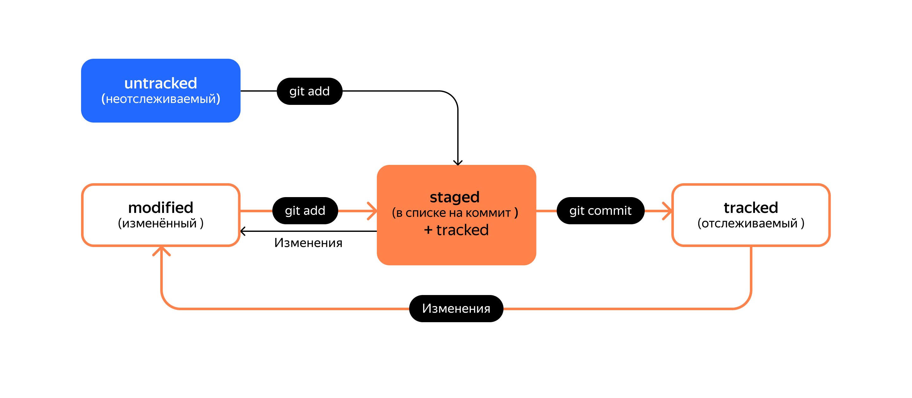

## Команды
  
* `git init` - инициализировать локальный репозиторий git
* `git status` - показать статус репозитория
* `rm -rf .git` - "разгитить" папку
* `git add [key]|[file_name]` - добавить файл в папке к репозиторию ключи:
    * `all` - все файлы в данной папке
    * `.` - всю текущую папку
* `git restore --staged <file>` - убрать файл из staging area
  * `git restore --staged .` - всю текущую папку
  * `git restore --hard <файл>` - конкретный файл
* `git diff` - разница между коммитами
* `git reset --staged <файл>` - конкретный файл
  * `git reset --hard <более ранний коммит>` - вернуть к более раннему коммиту
* `git reset --hard <commit hash>` - вернуть состояние репозитория к более раннему
  
  
* `git commit -m "<Описание>"` - зафиксировать изменения в репозитории
  * `git commit --amend --no-edit` - добавление в коммит изменений без изменения его описания
  * `git commit --amend -m "Новое сообщение"` - добавление в коммит изменений с заменой его описания 
* `git log` - история изменений репозитория
* `git push -u origin master` - пуш в мастер
* `git remote add origin https://github.com/YandexPracticum/first-project.git` — привяжи локальный репозиторий к удалённому с URL https://github.com/YandexPracticum/first-project.git;
* `git remote -v` (от англ. verbose, «подробный») — проверь, что репозитории действительно связались;
* `git push -u origin main` (от англ. push, «толкать») — в первый раз загрузи все коммиты из локального репозитория в удалённый с названием origin.
* `git checkout main` перешли в main
* `git pull` подтянули новые изменения в main
* `git checkout my-branch` вернулись в рабочую ветку my-branch
* `git merge main` влили main в новую ветку my-branch
* `git push -u origin my-branch` отправили ветку my-branch в удалённый репозиторий

## Сущности git

* <u>Хеш</u> — идентификатор коммита

  Git хранит таблицу соответствий хеш → информация о коммите.
* <u>Лог</u>

   1. Строка из цифр и латинских букв после слова commit — это хеш коммита.
   2. `Author` — имя автора и его электронная почта.
   3. `Date` — дата и время создания коммита.
   4. Сообщение к коммиту.
* <u>Файл `HEAD`</u> (англ. «голова», «головной») — один из служебных файлов папки `.git`.
Он указывает на коммит, который сделан последним (то есть на самый новый).

  Внутри `HEAD` — ссылка на служебный файл: `refs/heads/master` (или `refs/heads/main` в зависимости от названия ветки). 

## Статусы файлов

* `untracked` (англ. «неотслеживаемый»)

   Новые файлы в Git-репозитории помечаются как `untracked`, то есть неотслеживаемые. Git «видит», что такой файл существует,
   но не следит за изменениями в нём. У untracked-файла нет предыдущих версий, зафиксированных в коммитах или через команду git add.

* `staged` (англ. «подготовленный»)

   После выполнения команды git add файл попадает в staging area (от англ. stage — «сцена», «этап [процесса]» и area — «область»),
   то есть в список файлов, которые войдут в коммит. В этот момент файл находится в состоянии staged.

* `tracked` (англ. «отслеживаемый»)

   Состояние `tracked` — это противоположность `untracked`. Оно довольно широкое по смыслу: в него попадают файлы, которые уже
   были зафиксированы с помощью `git commit`, а также файлы, которые были добавлены в _staging area_ командой `git add`.
   То есть все файлы, в которых Git так или иначе отслеживает изменения.

* `modified` (англ. «изменённый»)

   Состояние `modified` значит, что Git сравнил содержимое файла с последней сохранённой версией и нашёл отличия. Например,
   файл был закоммичен и после этого изменён.

## Стили комментарев к коммитам

Комментарий должен быть кратким и информативным - что и для чего сделано, например

> Исправить сообщение об ошибке E123
 
* <u>Корпоративный стиль</u> - использованием номера задачи из Jira:

   `$ git commit -m "LGS-239: Дополнить список пасхалок новыми числами"`

* <u>Conventional Commits</u> - для репозиториев с исходным кодом программ;

  формат коммита: `<type>: <сообщение>`.
 
  * Первая часть `type` — это тип изменений, например:

    * `feat` (сокращение от англ. feature) — для новой функциональности;
    * `fix` (от англ. «исправить», «устранить») — для исправленных ошибок.

* <u>GitHub-стиль</u>
  
  GitHub можно использовать не только для хранения файлов проекта, но и для ведения списка задач (англ. issue) этого проекта.

  `$ git commit -m "Исправить #334, добавить график температуры"`

  GitHub свяжет коммит и задачу